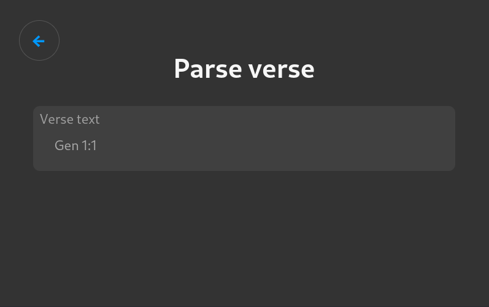
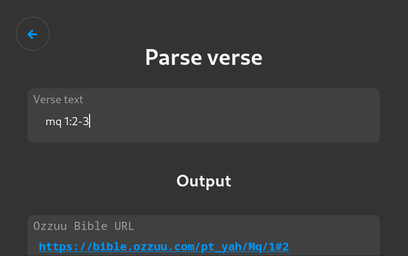
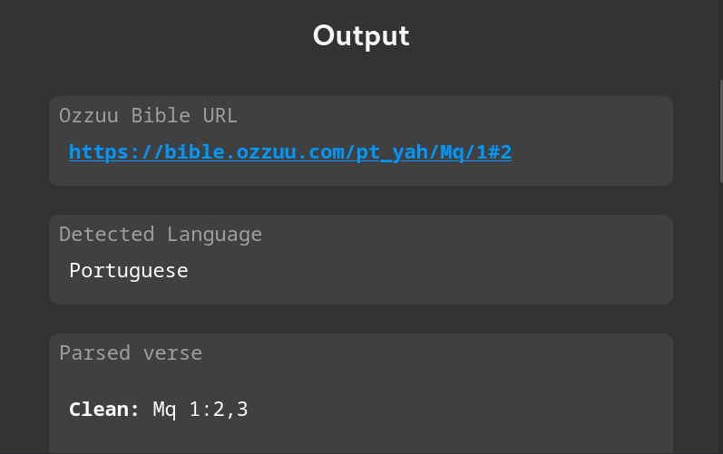
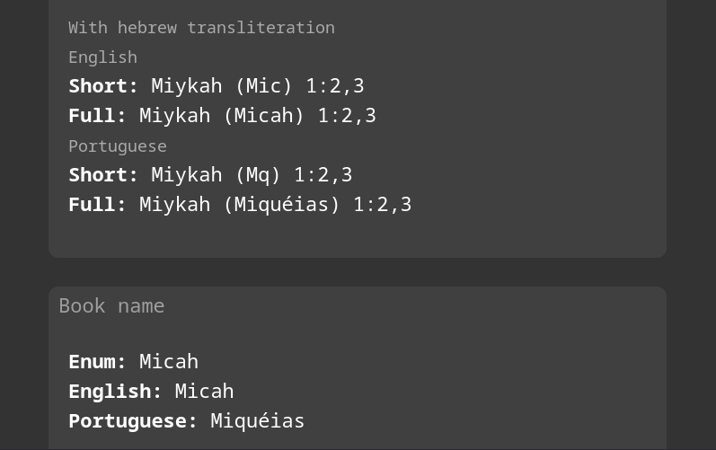

# Ozzuu Tools

**[About](#about)** - [License](#license)

**DocID**

**Bible Tools**

## About

This project is a web interface to some of my Nim libs.

## TODO

- [ ] Transform in a SPA using hash routing

## License

This project is FOSS, licensed over GPL-3 license.
